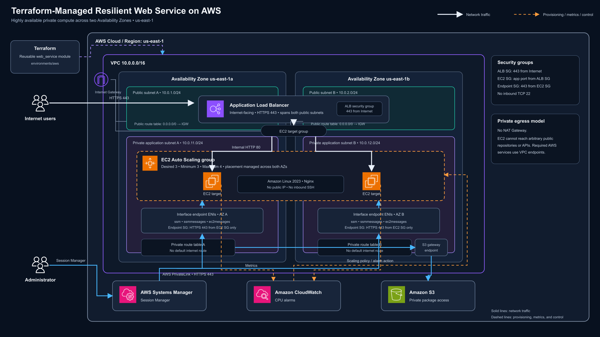

# Resilient AWS Web Service with Terraform

This project deploys a small web service on AWS using Terraform. I built it to learn how to improve on a basic public EC2 deployment by adding private networking, load balancing, automatic recovery, and safer administrative access.

The application runs on three private EC2 instances behind a public Application Load Balancer. An Auto Scaling Group maintains capacity across two Availability Zones, and AWS Systems Manager provides access without SSH or public IP addresses.

I developed the reusable Terraform module with the local Floci emulator, validated it in real AWS, documented the results, and destroyed the resources afterward to control cost.

## Architecture

[](docs/architecture/aws-resilient-web-service.svg)

The VPC spans two Availability Zones, with a public and private subnet in each. The public subnets host the load balancer and route internet traffic through an Internet Gateway. The private subnets host the EC2 instances and have no default route to the internet. VPC endpoints provide private paths to the AWS services the instances need.

## Why It Is Resilient

- Resources span two Availability Zones instead of depending on one location.
- Public and private subnets exist in both Availability Zones, so the network design supports workloads in either zone.
- The Auto Scaling Group maintains three instances and can replace unhealthy ones.
- Load balancer health checks prevent traffic from reaching unhealthy targets.
- CloudWatch CPU alarms can scale capacity between three and four instances.
- Rolling instance refreshes keep at least 70% of the group healthy during updates.
- Terraform makes the environment repeatable and reviewable.

## Why It Is Safer

- EC2 instances have no public IPv4 addresses.
- Separate route tables keep the private subnets from receiving a direct internet route.
- Administration uses Session Manager instead of SSH or key pairs.
- EC2 accepts HTTP only from the load balancer security group.
- Systems Manager endpoints accept HTTPS only from the EC2 security group.
- S3 and Systems Manager VPC endpoints provide private access to required AWS services without a NAT Gateway.
- AWS credentials are supplied externally and are not stored in Terraform files.
- State files, credentials, logs, and other sensitive local files are excluded from Git.

## AWS Validation

I deployed the project in `us-east-1` and confirmed that:

- The public load balancer returned the expected Nginx response.
- All three EC2 targets were healthy across two Availability Zones.
- The instances had no public IP addresses.
- The private route tables had no default internet route or NAT Gateway.
- The S3 and Systems Manager endpoints were available.
- All instances appeared online in Systems Manager Fleet Manager.
- Session Manager provided shell access without SSH.
- A final Terraform plan reported no configuration differences.
- `terraform destroy` removed the temporary AWS resources.

[View the sanitized deployment evidence →](docs/evidence/README.md)


## Repository Structure

```text
terraform-arch/
├── environments/
│   ├── aws/          # Real AWS configuration
│   └── floci/        # Local emulator configuration
├── modules/
│   └── web_service/  # Reusable infrastructure module
└── docs/
    ├── architecture/ # Presentation-ready architecture diagram
    └── evidence/     # Sanitized AWS screenshots
```

## Run the Project

Use an authenticated AWS CLI profile and do not place credentials in Terraform files.

```bash
cd environments/aws
export AWS_PROFILE=terraform-lab
aws sso login
terraform init
terraform plan
terraform apply
```

Retrieve the load balancer address with `terraform output -raw alb_dns_name`. When finished, run `terraform destroy` because EC2, the load balancer, and interface endpoints can create hourly charges.

For local development with Floci, run the same Terraform commands from `environments/floci` while the emulator is available on port `4566`.

## Next Steps

The current scope focuses on a multi-AZ VPC, isolated private compute, secure administration, and automated scaling. Future improvements include TLS with ACM, encrypted remote state with locking, tighter IAM policies, centralized logging, consistent resource tags, and automated Terraform checks in CI.

## What I Learned

This project gave me hands-on experience with Terraform modules, AWS networking, load balancing, Auto Scaling, IAM, VPC endpoints, Systems Manager, troubleshooting, and cost-aware cleanup. More importantly, I learned why private networking, health checks, multiple Availability Zones, and controlled administrative access matter.
