# Deployment Evidence

These sanitized screenshots document the temporary deployment against real AWS services.

## Application and Load Balancing

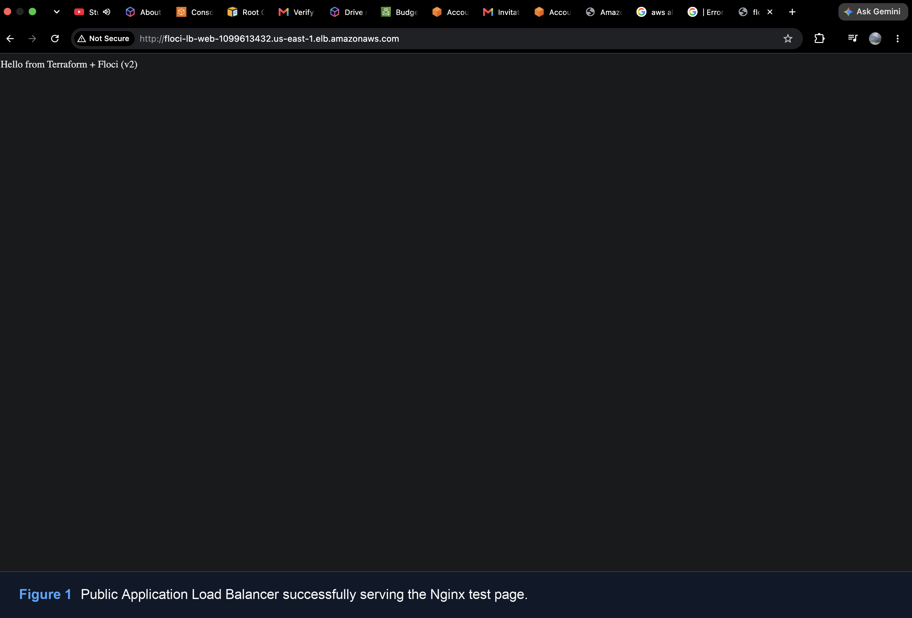

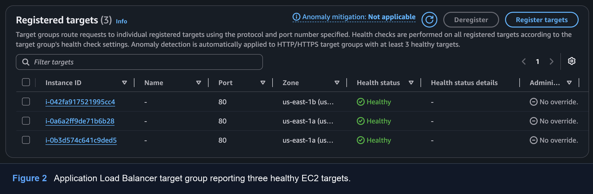

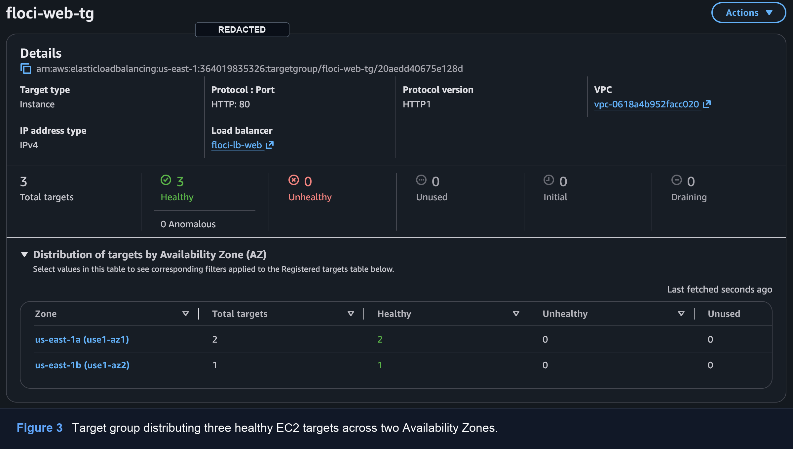

## Compute and Networking

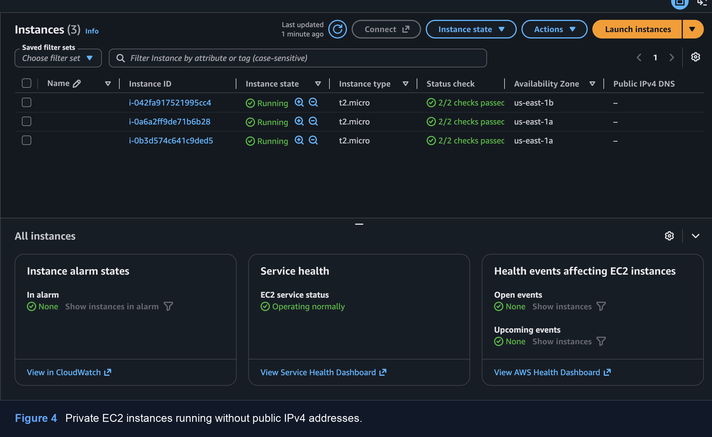

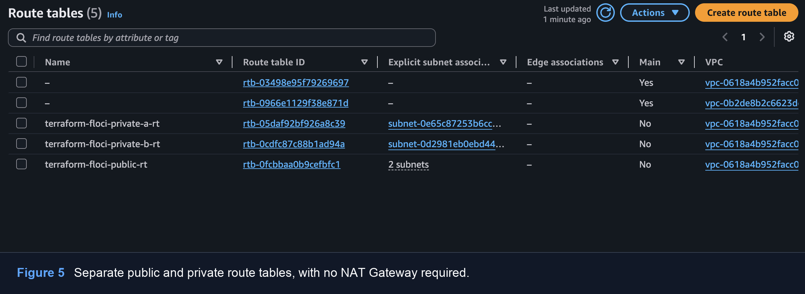

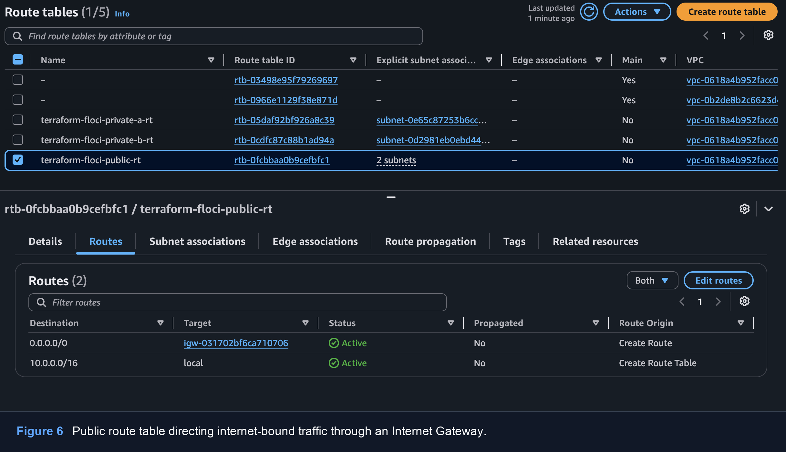

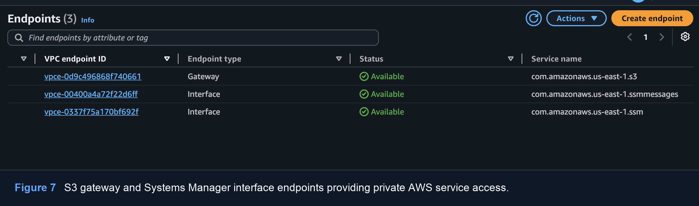

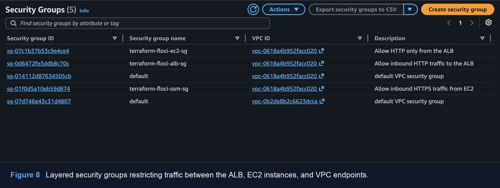

## Private Administration and Configuration Validation

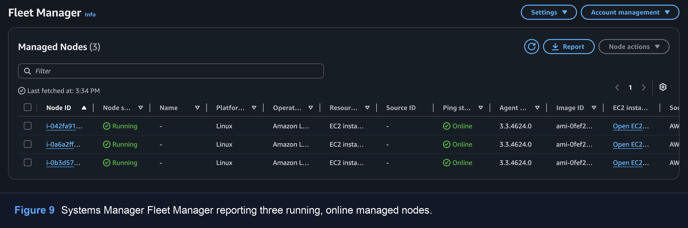

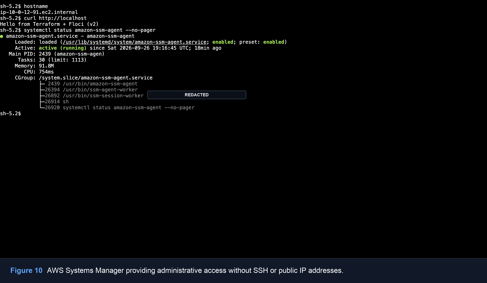

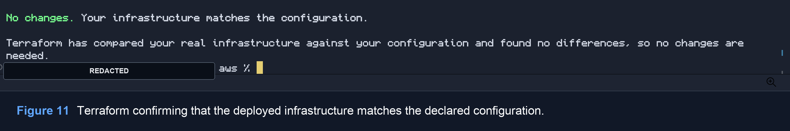

